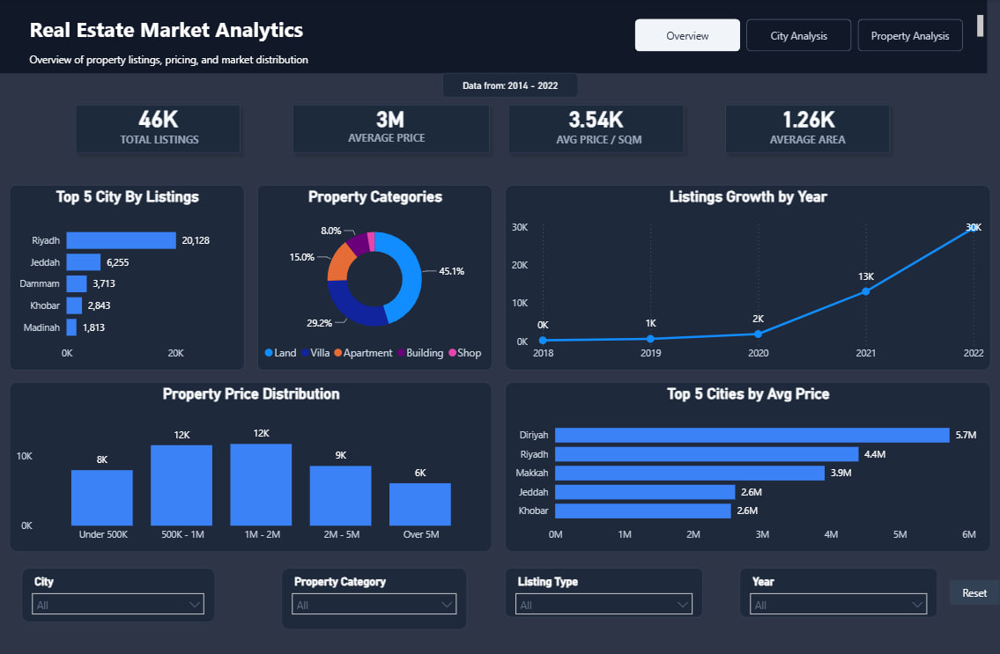
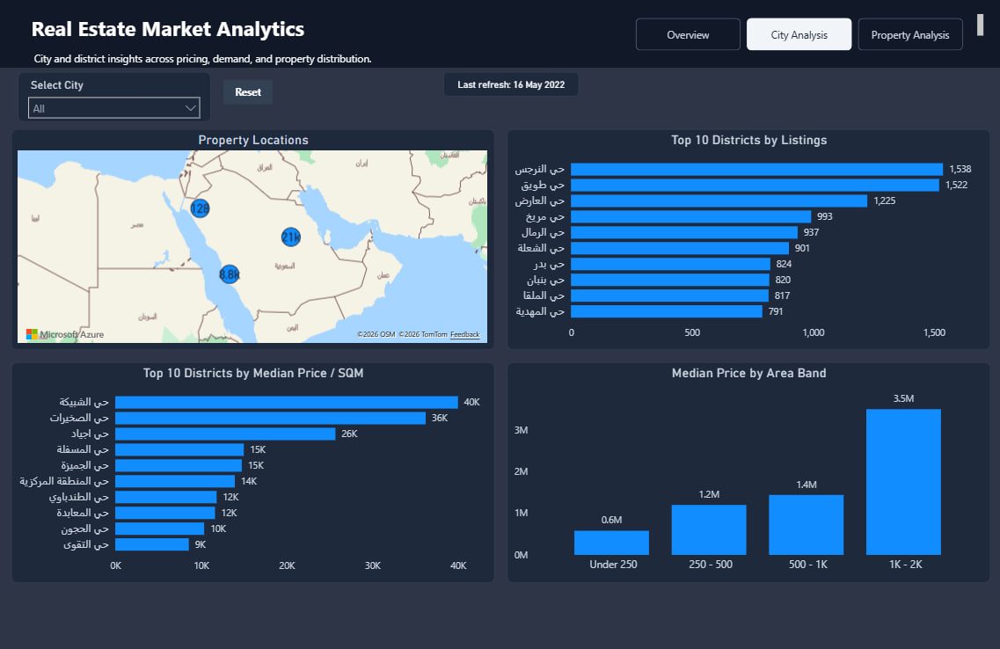
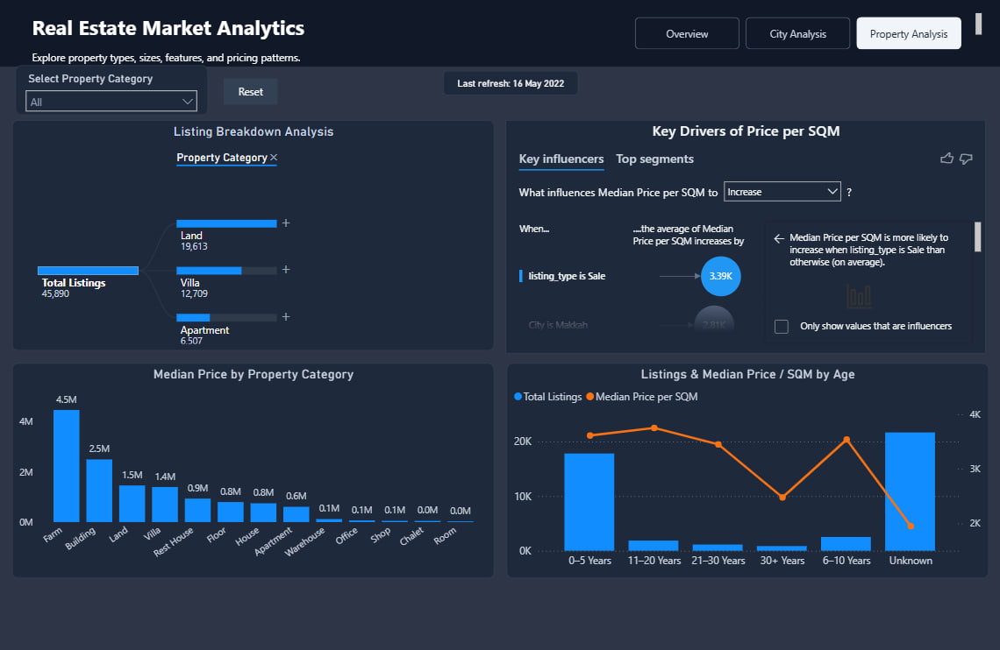

# Saudi Real Estate Market Analytics Dashboard

## Project Overview

An end-to-end data analytics project that analyzes historical Saudi Arabia real estate listings to identify market trends, pricing patterns, location differences, and property distribution.

The project demonstrates a complete analytics workflow:

**Data Cleaning → SQL Analysis → Power BI Dashboard → Business Insights**

---

## Dataset

The dataset used in this project was obtained from Kaggle and contains historical real estate listings from Saudi Arabia.

- **Source:** Kaggle
- **Data period:** 2014–2022
- **Records analyzed:** 45,890 listings
- **Columns:** 22
- **Important note:** The dataset contains historical listing data and does not represent current Saudi real estate market conditions.

The dashboard displays **Data from: 2014–2022** to clarify the period covered by the analysis.

> Add the original Kaggle dataset link here when available.

---

## Tools & Technologies

- Python
- Pandas
- MySQL
- SQL
- Power BI
- CSV

---

## Project Workflow

### 1. Data Cleaning & Preparation

The real estate dataset was explored, cleaned, and prepared using Python and Pandas.

Main tasks included:

- Reviewing the dataset structure and data quality
- Checking missing values
- Standardizing column names and data types
- Cleaning inconsistent values
- Preparing the dataset for MySQL and Power BI
- Creating analytical columns for time-based and pricing analysis

Created features included:

- Price per Square Meter
- Listing Year
- Listing Month
- Period Month

The final dataset contains approximately **45,890 listings** and **22 columns**.

---

### 2. SQL Analysis

The cleaned dataset was imported into MySQL for analytical querying.

The SQL analysis included:

- Overall market KPIs
- Listings by city
- Average price by city
- Property category distribution
- Sale and rent distribution
- Listings growth by year
- District-level analysis
- Price per square meter analysis
- Area-band analysis

The SQL queries used in the project are available in:

```text
SQL/analysis_queries.sql
```

---

## Power BI Dashboard

The Power BI dashboard contains three interactive analytical pages.

Dashboard features include:

- Unified page navigation
- Interactive slicers
- Reset filter buttons
- Dynamic KPI values
- Data-period indicator
- Report-page tooltips
- Tooltip-based key insights
- Hidden tooltip pages
- Key Influencers visual
- Interactive filtering and cross-highlighting

### Tooltip-Based Insights

Each main dashboard page uses a dedicated report-page tooltip.

When the user hovers over supported charts, the tooltip displays:

- Context-specific KPI values for the selected data point
- Key analytical insights related to the dashboard page
- Supporting metrics without taking additional space on the main report canvas

The key insights are presented through tooltips to keep the dashboard clean while still providing deeper analysis.

---

## Dashboard Pages

### Overview

The Overview page provides a high-level summary of the real estate market.

It includes:

- Total Listings
- Average Price
- Average Price per Square Meter
- Average Area
- Top Cities by Listings
- Property Category Distribution
- Listings Growth by Year
- Property Price Distribution
- Top Cities by Average Price
- Tooltip insights summarizing major market patterns



---

### City Analysis

The City Analysis page focuses on geographical and district-level patterns.

It includes:

- Property Locations Map
- Top Districts by Listings
- District Median Price per Square Meter
- Median Price by Area Band
- City Filter
- Interactive Tooltips
- Tooltip insights highlighting leading cities and districts



---

### Property Analysis

The Property Analysis page focuses on property characteristics and pricing factors.

It includes:

- Listing Breakdown Analysis
- Key Drivers of Price per Square Meter
- Median Price by Property Category
- Listings and Median Price per Square Meter by Property Age
- Property Category Filter
- Key Influencers Analysis
- Tooltip insights summarizing property-type and listing-type patterns



---

## Key Insights

The dashboard tooltips surface key findings such as:

- Riyadh has the highest number of real estate listings.
- Land is the most listed property type.
- Sale listings represent the majority of the dataset.
- Property prices vary considerably by city, district, property type, and property size.
- Location and property characteristics strongly influence price per square meter.
- Listing activity changed significantly across the 2014–2022 data period.

---

## Project Structure

```text
Saudi-Real-Estate-Analytics/
│
├── Data/
│   └── cleaned_real_estate_listings.csv
│
├── Notebook/
│   └── data_cleaning.ipynb
│
├── SQL/
│   └── analysis_queries.sql
│
├── Dashboard/
│   └── Saudi_Real_Estate_Analytics.pbix
│
├── Images/
│   ├── Overview.png
│   ├── City_Analysis.png
│   └── Property_Analysis.png
│
└── README.md
```

---

## How to Use This Project

1. Open `Notebook/data_cleaning.ipynb` to review the Python data-cleaning workflow.
2. Review `SQL/analysis_queries.sql` to explore the MySQL analysis.
3. Open `Dashboard/Saudi_Real_Estate_Analytics.pbix` using Power BI Desktop.
4. Navigate between the three dashboard pages.
5. Use the slicers and reset buttons to explore filtered views.
6. Hover over charts to display the report-page tooltips and key insights.

---

## Data Disclaimer

This project is intended for portfolio and educational purposes.

The findings are based on a historical Kaggle dataset covering **2014–2022**. Listing prices represent advertised prices in the dataset and should not be interpreted as current market prices or completed transaction values.

---

## Author

Fares Abdullah Alghamdi

Computer Science Graduate  
Data Analytics & Business Intelligence
